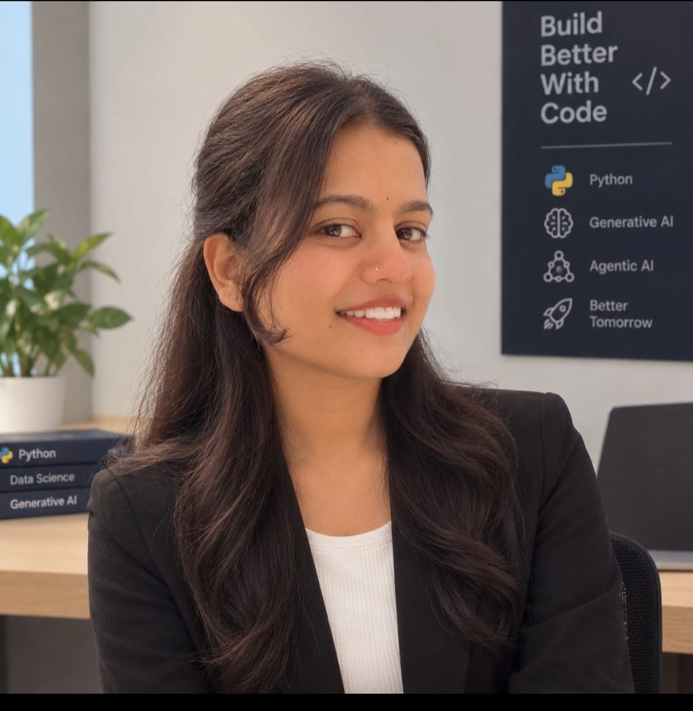

<h1 align="center">Hi, I'm Akshata Kamble 👋</h1>

<p align="center">
  <b>BCA Graduate · Aspiring AI Engineer · Learning Generative AI &amp; Agentic AI with Python</b>
</p>

<p align="center">
  <a href="https://github.com/akshatakamble244-hub"></a>
</p>

<p align="center">
  <a href="https://www.linkedin.com/in/akshata-kamble-a100b8384/"></a>
  <a href="https://github.com/akshatakamble244-hub"></a>
  <a href="mailto:akshatakamble244@gmail.com"></a>
</p>

---

## 📌 About Me

I am a **BCA graduate** and an aspiring **AI Engineer** who enjoys turning ideas into working
applications. After completing my Bachelor of Computer Applications, I moved into **Generative AI and
Agentic AI with Python**, and I spend most of my time building practical projects so I can understand
how these technologies behave on real problems rather than only in theory.

I am interested in Artificial Intelligence, Machine Learning, Deep Learning and intelligent systems. I
like working with data, exploring large language models, and improving my technical skills through
continuous, hands-on learning.

> **My approach is simple** — I learn a concept, build something with it, experiment, improve it, and
> then share what I learned.

**Live site:** <https://akshatakamble244-hub.github.io/Akshata-Portfolio/>

---

## 🎓 Education

| Period | Qualification | Institution | Result |
| --- | --- | --- | --- |
| 2023 – 2026 | Bachelor of Computer Applications (BCA) | Raje Ramrao Mahavidyalaya, Jath — Shivaji University, Kolhapur | CGPA: **7.42** |
| 2022 – 2023 | Higher Secondary Certificate (HSC) | — | **43.33%** |
| 2020 – 2021 | Secondary School Certificate (SSC) | — | **83.20%** |

---

## 🧠 Skills & Technologies

### AI & Generative AI
Generative AI · Agentic AI · Artificial Intelligence · Machine Learning · Deep Learning ·
Large Language Models (LLMs) · Retrieval-Augmented Generation (RAG) · AI Agents ·
LangChain · LangGraph · Ollama

### Programming & Data
Python · SQL · MySQL · Streamlit

### Tools & Workflow
Git · GitHub

---

## 🛠️ Technologies Used in This Portfolio Website

This repository is the source code of my portfolio site. It is a hand-written static website with
**no frameworks, no build step and no runtime dependencies**.

| Technology | How it is used here |
| --- | --- |
| **HTML5** | Semantic page structure across 8 sections, inline SVG icons, downloadable resume link |
| **CSS3** | Custom properties (design tokens), Grid, Flexbox, `@keyframes` animation, 7 responsive breakpoints |
| **Vanilla JavaScript** | All interactivity, written in plain ES5-compatible JavaScript — no jQuery, no libraries |
| **Canvas 2D API** | Full-screen animated particle background of drifting neon bubbles, dots, rings and shapes |
| **`requestAnimationFrame`** | The animation loop, paused automatically when the tab is hidden or off-screen |
| **`IntersectionObserver`** | Fades each section in as it scrolls into view (with a fallback for older browsers) |
| **Pre-rendered canvas sprites** | Every shape × colour × blur combination is drawn once and reused, keeping the animation light on mobile |
| **Google Fonts** | Space Grotesk (headings), Inter (body), JetBrains Mono (monospace) |
| **CSS Custom Properties** | One `:root` token block re-themes colours, spacing, motion and typography for the whole site |
| **SEO & Social meta** | Title, description, keywords, canonical URL, Open Graph and Twitter card tags |
| **`mailto:` contact form** | Serverless contact form that opens the visitor's email client with the message pre-filled |

### Design & Quality Features

- **Dark neon theme** — deep navy background with cyan and neon-blue glow borders
- **Dual navigation** — a fixed top bar plus a vertical icon rail on the right, both with active-section highlighting
- **Responsive** — layouts for mobile, tablet, laptop and ultra-wide screens
- **Mobile drawer menu** — hamburger navigation that closes on overlay tap and the `Escape` key
- **Smart scroll** — smooth scrolling that offsets for the fixed top bar and respects the user's motion preference
- **Readability-safe decorations** — floating bubbles measure the real position of every text block and only place themselves in genuinely empty space, so nothing ever covers the content
- **Accessibility** — ARIA labels, semantic landmarks, keyboard support and a `prefers-reduced-motion` mode that disables animation
- **Performance** — canvas pauses on hidden tabs, particle count scales down on small screens, and device pixel ratio is capped at 2
- **Zero build tooling** — loads instantly from GitHub Pages

---

## 🚀 Portfolio Project Features

This site is more than a list of links. It includes:

- **Home** — profile photo, headline, introduction and calls to action
- **About Me** — background, what I am learning and how I work
- **Skills** — AI, Generative AI, programming and tooling cards
- **Education** — interactive-style vertical timeline with results
- **Projects** — featured project with a direct repository link, plus other work
- **Learning & Career** — what I am studying, my interests, career goal and my Learn → Build → Experiment → Improve → Share approach
- **Certificate** — a section that is ready to be filled with verified credentials
- **Contact** — validated contact form and direct email, GitHub and LinkedIn links
- **Animated background** — a canvas particle field plus floating decorative bubbles that react to mouse and touch
- **Resume download** — one-click download of my PDF resume

---

## 💻 Projects

### 1. AI Customer Support Agent — *Featured*
An AI-based customer support application that handles customer queries and provides useful
responses using structured customer and order information.

**Stack:** Python · AI · MySQL · Ollama · Customer Support Automation

[View on GitHub →](https://github.com/akshatakamble244-hub/AI-Customer-Support-Agent/tree/main)

### 2. Student LangChain Chatbot
A Generative AI student chatbot exploring LangChain, Retrieval-Augmented Generation (RAG) and local
LLM workflows.

**Stack:** Python · Generative AI · LangChain · RAG · Ollama

### 3. Python Basic Programs
A collection of Python programs covering programming fundamentals and problem solving.

**Stack:** Python · Problem Solving

---

## 🚀 How to Run This Project

This is a **static website** — there is nothing to install and no build required.

### Option 1 — Open it directly

Double-click `index.html`, or open it in your browser:

```
index.html
```

### Option 2 — Run a local server (recommended)

Using Python:

```bash
# From the project root
python -m http.server 8000
```

Then visit <http://localhost:8000>

Using Node.js:

```bash
npx serve .
```

Using VS Code:
Install the **Live Server** extension, right-click `index.html` and choose **Open with Live Server**.

### Deploying to GitHub Pages

1. Push this repository to GitHub.
2. Go to **Settings → Pages**.
3. Under **Source**, select the branch and the `/ (root)` folder, then save.
4. Your site will be live at `https://<username>.github.io/Akshata-Portfolio/`.

---

## 📂 Project Structure

```
Akshata-Portfolio/
├── index.html                  # Page structure and all content
├── style.css                   # Design tokens, layout, animations, responsive rules
├── script.js                   # Navigation, scroll effects, contact form, canvas background
├── images/
│   └── profile.jpg             # Profile photo
└── resume/
    └── Akshata_Kamble_Resume.pdf
```

---

## 🛠️ Built With

- HTML5
- CSS3
- Vanilla JavaScript
- Canvas 2D API
- Google Fonts

---

## 📫 Let's Connect

I'm always happy to talk about AI, machine learning, or Generative AI projects.

[](https://github.com/akshatakamble244-hub)
[](https://www.linkedin.com/in/akshata-kamble-a100b8384/)
[](mailto:akshatakamble244@gmail.com)

---

<p align="center">
  Designed and built by <b>Akshata Kamble</b>
</p>
